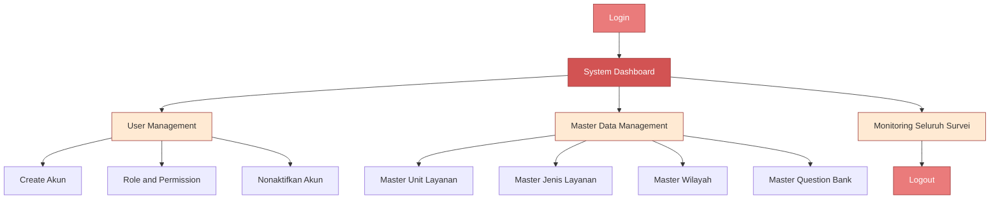
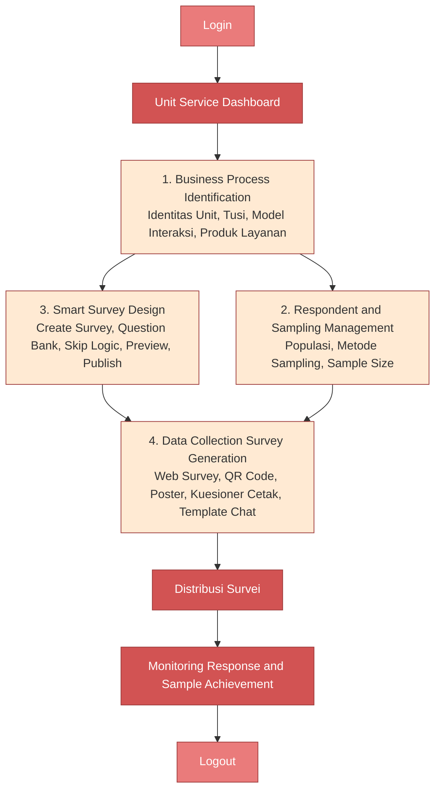
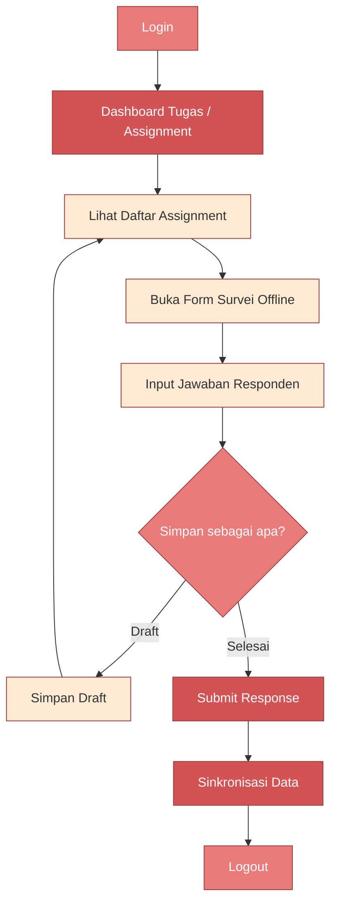
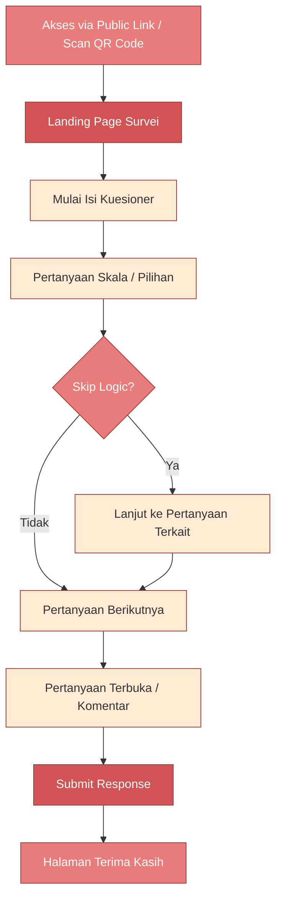

# PRD — Prototype Website SKM (Survei Kepuasan Masyarakat)

**Versi:** 2.0 (Prototype / Tampilan Awal — Detail per Modul & Halaman)
**Tujuan Dokumen:** Acuan eksekusi tampilan awal (prototype) menggunakan HTML, CSS, dan JavaScript, lengkap dengan alur (flow), rincian tiap halaman, dan panduan desain agar hasilnya informatif sekaligus ramah digunakan (family friendly) — mengingat penggunanya mencakup masyarakat umum sebagai responden.

---

## 1. Ringkasan Proyek

Website SKM (Survei Kepuasan Masyarakat) membantu Unit Layanan Publik merancang, mendistribusikan, mengumpulkan, dan memantau survei kepuasan masyarakat — mulai dari identifikasi proses bisnis layanan hingga pengumpulan data dari responden, baik online maupun offline.

## 2. Tujuan Prototype

- Menyediakan bukti konsep (proof of concept) tampilan antarmuka sesuai workflow yang sudah disetujui.
- Memvalidasi alur kerja (user flow) tiap role sebelum masuk tahap pengembangan sistem penuh (backend, integrasi API, dsb).
- Menjadi dasar diskusi & approval pimpinan (chief) sebelum eksekusi pengembangan lanjutan.
- Memberi acuan yang cukup rinci (per modul & per halaman) agar dapat langsung digenerate menjadi kode HTML/CSS/JS tanpa banyak ambiguitas.

## 3. Ruang Lingkup (Scope)

### 3.1 In-Scope (Prototype Tahap Ini)

Mengikuti 4 tahap utama workflow: **Business Process Identification → Respondent & Sampling Management → Smart Survey Design → Data Collection Survei**, beserta modul pendukungnya (Authentication, Dashboard, Master Data dasar, User Management dasar).

### 3.2 Out-of-Scope (Fase Berikutnya)

Monitoring & EWS lanjutan, Data Processing otomatis, Advanced Analytics, AI Insight, Reporting & Presentation, Approval/TTE/Publication, System Configuration/Integration/Backup — modul-modul ini di luar workflow yang dikirim dan masuk backlog fase 2.

## 4. Role & Level Pengguna

| Level | Role | Pengguna | Fokus Akses | Cakupan |
|---|---|---|---|---|
| Level 0 | Super Admin | Indekstat / System Administrator | Pengelolaan & konfigurasi sistem | Seluruh sistem |
| Level 1 | Admin Unit Layanan | UPT / UPP / Unit Pelayanan | Perencanaan, pelaksanaan, monitoring SKM | Unit layanan masing-masing |
| Level 2 | Enumerator / Survey Officer | Petugas survei | Pengumpulan & input data survei | Assignment yang diberikan |
| Public | Responden | Masyarakat / Pengguna Layanan | Pengisian kuesioner SKM | Survei yang diakses |

## 5. Hak Akses Fitur (Sudah Difilter untuk Prototype)

Legenda: ✓ = Akses penuh · E = Input/Edit (data profil layanan) · — = Tidak ada akses

| Modul / Fitur | Super Admin | Admin Unit Layanan | Enumerator | Responden |
|---|:---:|:---:|:---:|:---:|
| **A. Authentication & Access** |
| Login / Logout / Forgot & Change Password | ✓ | ✓ | ✓ | — |
| User Management, Role & Permission | ✓ | — | — | — |
| **B. Dashboard** |
| Unit Service Dashboard, Survey Status, Task/Assignment | ✓ | ✓ | ✓ | — |
| **C. Business Process Identification** |
| Identitas Unit, Tusi, Model Interaksi, Produk, Prosedur Layanan | ✓ | E | — | — |
| **D. Smart Survey Design** |
| Create Survey, Question Bank, Scale/Skip Logic, Preview, Publish | ✓ | ✓ | — | — |
| **E. Respondent & Sampling Management** |
| Populasi, Metode Sampling, MoE/CL, Target & Distribusi Sample | ✓ | ✓ | — | — |
| **F. Survey Generation** |
| Web Survey, Link, QR, Poster, Banner, Kuesioner Cetak, Form Enumerator | ✓ | ✓ | — | — |
| **G. Survey Distribution** |
| Public Link, QR Distribution | ✓ | ✓ | — | ✓ |
| Template WA/Email/SMS (tampilan statis) | ✓ | ✓ | — | — |
| **H. Data Collection** |
| Online Response | ✓ | ✓ | ✓ | ✓ |
| Offline Input, Enumerator Assignment, Draft, Submit | ✓ | ✓ | ✓ | ✓ (submit saja) |
| **I. Master Data Pendukung** |
| Master Unit Layanan | ✓ | — | — | — |
| Master Wilayah, Master Question Bank | ✓ | ✓ | — | — |

## 6. User Requirement Utama (Traceability)

| ID | Pengguna | Modul | User Requirement | Output |
|---|---|---|---|---|
| UR-01 | Super Admin | Access Management | Mengelola akun, role, hak akses | Akun & hak akses terkelola |
| UR-02 | Super Admin | Master Data | Mengelola master unit, wilayah, question bank | Master data terstruktur |
| UR-04 | Admin Unit Layanan | Business Process | Identifikasi karakteristik layanan | Profil layanan |
| UR-05 | Admin Unit Layanan | Survey Design | Membuat instrumen SKM | Kuesioner SKM |
| UR-06 | Admin Unit Layanan | Sampling | Populasi, metode, ukuran sampel | Sampling plan |
| UR-07 | Admin Unit Layanan | Survey Generation | Kanal survei online & offline | Web survey, QR, kuesioner |
| UR-08 | Admin Unit Layanan | Distribution | Distribusi lintas kanal | Survei terdistribusi |
| UR-09 | Admin Unit Layanan | Data Collection | Monitoring pengumpulan data | Monitoring response |
| UR-10 | Enumerator | Data Collection | Input data survei offline | Data responden |
| UR-17 | Responden | Survey Response | Isi survei tanpa login | Response survei |

*(Rincian fungsi sistem per requirement sudah dipecah menjadi spesifikasi per halaman di Bab 8, agar langsung actionable saat generate UI.)*

---

## 7. Design System — Informatif & Family Friendly

Prinsip desain: **jelas, hangat, tidak kaku ala birokrasi**, karena responden adalah masyarakat umum dari berbagai usia & latar belakang, sedangkan admin/enumerator butuh tampilan kerja yang tetap rapi dan efisien.

### 7.1 Palet Warna

| Token | Hex | Penggunaan |
|---|---|---|
| `--color-primary` | `#D25353` | Tombol utama, header/topbar, elemen aktif |
| `--color-primary-light` | `#EA7B7B` | Hover state, badge, aksen ikon, highlight ringan |
| `--color-primary-dark` | `#9E3B3B` | Teks penekanan, border aktif, state pressed |
| `--color-surface` | `#FFEAD3` | Latar section, card soft, background halaman publik |
| `--color-bg` | `#FFFFFF` | Latar utama halaman admin/enumerator |
| `--color-text` | `#3A2E2E` | Teks utama (coklat gelap hangat, bukan hitam pekat, kesan lebih ramah) |
| `--color-text-muted` | `#8C7A70` | Teks sekunder/placeholder |
| `--color-success` | `#4C9A6A` | Status berhasil, badge "Selesai" |
| `--color-warning` | `#E0A93E` | Status "Draft"/"Perlu perhatian" |
| `--color-danger` | `#C0392B` | Validasi error (senada keluarga merah, tapi dibedakan dari primary) |
| `--color-border` | `#F1D9C0` | Border tipis, divider |

> Catatan: warna success/warning/danger sengaja **berbeda** dari primary agar status di dashboard tetap mudah dibedakan sekilas mata, sementara tetap harmonis dengan palet dasar (nuansa hangat/terracotta).

### 7.2 Tipografi

- **Halaman publik (Responden):** font rounded & ramah, mis. `Poppins` atau `Nunito` — ukuran dasar lebih besar (16–18px) karena diisi lintas usia via HP.
- **Halaman admin/enumerator:** font netral-rapi untuk kerja panjang, mis. `Inter` atau `Plus Jakarta Sans`, ukuran dasar 14–15px.
- Skala ukuran: `H1 28–32px / H2 22–24px / H3 18–20px / Body 14–16px / Caption 12–13px`, line-height ±1.5 untuk keterbacaan.

### 7.3 Spacing, Radius & Elevation

- Spacing scale: `4 / 8 / 12 / 16 / 24 / 32 / 48px`.
- Border radius: `8px` (input/button kecil), `12–16px` (card), `999px`/full (badge/pill, avatar).
- Shadow lembut: `0 2px 8px rgba(158,59,59,0.08)` untuk card — hindari shadow tajam/gelap agar terasa ringan.

### 7.4 Ikonografi & Ilustrasi

- Gunakan set ikon outline/rounded yang konsisten (mis. Lucide/Feather Icons) — hindari ikon tajam bergaya "sistem korporat kaku".
- Sisipkan ilustrasi sederhana pada: halaman landing survei, empty state (belum ada data), dan halaman terima kasih — memberi kesan hangat & manusiawi, bukan sekadar tabel/form.
- Untuk skala kepuasan di kuesioner, gunakan **emoji/ikon ekspresi wajah** (😞 🙁 😐 🙂 😄) berdampingan dengan skala angka — lebih mudah dipahami semua kalangan.

### 7.5 Komponen UI Dasar

`navbar`, `sidebar` (khusus admin/enumerator), `card`, `button (primary/secondary/ghost)`, `badge/status-pill`, `stepper/progress-bar`, `table`, `modal`, `toast/notifikasi`, `form input/select/radio/checkbox/textarea`, `empty-state`, `upload dropzone`, `cascading-select` (wilayah), `rating-scale (emoji + angka)`.

### 7.6 Nada Bahasa (Microcopy)

- Gunakan bahasa Indonesia yang hangat & langsung, hindari istilah birokratis kaku.
- Contoh: bukan *"Data tidak valid"* → **"Yuk, lengkapi dulu bagian ini ya"**; bukan *"Submit berhasil"* → **"Terima kasih! Jawabanmu sudah kami terima 🎉"**.
- Untuk admin/enumerator boleh sedikit lebih formal-efisien, tapi tetap suportif: mis. *"Survei berhasil diterbitkan, link & QR sudah aktif."*

### 7.7 Aksesibilitas & Responsif

- Kontras teks terhadap background minimum sesuai WCAG AA (perhatikan teks putih di atas `#EA7B7B` cukup kontras, uji ulang saat implementasi).
- Target sentuh (tombol/opsi jawaban) minimal 44x44px, khususnya di halaman Responden yang didominasi akses HP via QR.
- Layout admin: desktop-first, tetap dapat discroll wajar di tablet. Layout Responden & Enumerator: **mobile-first**.

---

## 8. Modul & Halaman per Role (Detail Lengkap)

### 8.1 Super Admin



#### 8.1.1 Halaman Login — `/login`
- **Tujuan:** autentikasi seluruh role (Super Admin, Admin Unit, Enumerator).
- **Layout:** card terpusat, logo instansi di atas, form login di tengah; opsional ilustrasi ringan di sisi kiri (desktop).
- **Field:** Username/Email, Password (toggle show/hide), checkbox "Ingat saya", link "Lupa password?".
- **Tombol:** "Masuk" (primary). State: *default / loading (spinner di tombol) / error* (border merah + pesan ramah: "Email atau password belum sesuai, coba lagi ya").
- **Aksi:** redirect ke dashboard sesuai role (untuk kebutuhan demo, boleh tambahkan role-switcher kecil di prototype agar mudah didemokan ke chief).

#### 8.1.2 Lupa/Ubah Password — `/forgot-password`, `/change-password`
- Form email (forgot) → tampilan konfirmasi "Cek email kamu untuk reset password" (dummy, tanpa kirim email sungguhan).
- Change password: field password lama, baru, konfirmasi + indikator kekuatan password sederhana.

#### 8.1.3 System Dashboard — `/admin/dashboard`
- **Komponen:** topbar (nama user, avatar, ikon notifikasi), sidebar menu, 4 **summary card**: Total Unit Layanan Aktif, Total Survei Berjalan, Total Pengguna, Total Respon Masuk (semua dummy angka).
- Grafik ringan (bar chart) "Jumlah Survei per Unit Layanan".
- Tabel "Aktivitas Terbaru" (user, aksi, waktu).
- **Empty state:** ilustrasi + teks "Belum ada aktivitas tercatat".

#### 8.1.4 User Management — `/admin/users`
- **Tabel:** Nama, Email, Role, Unit Layanan, Status (badge pill: Aktif hijau / Nonaktif abu), Aksi (Edit, Nonaktifkan).
- Search bar + filter dropdown by Role.
- **Modal "Tambah/Edit Pengguna":** Nama, Email, Role (dropdown: Admin Unit/Enumerator), Unit Layanan (dropdown), Password sementara.
- **Modal "Role & Permission":** matriks checklist akses per modul (mengacu Bab 5), read-only/toggle sesuai kebutuhan demo.

#### 8.1.5 Master Data — `/admin/master/unit-layanan`, `/wilayah`, `/question-bank`
- **Master Unit Layanan:** tabel (Nama Unit, Kode, Alamat, Aksi), modal tambah/edit.
- **Master Wilayah:** cascading select berjenjang Provinsi → Kab/Kota → Kecamatan → Desa (dummy data), tabel & form tambah.
- **Master Question Bank:** list pertanyaan dengan tag kategori (mis. 9 unsur pelayanan) & tipe jawaban (skala/pilihan/terbuka), tombol "+ Tambah Pertanyaan Standar", search & filter kategori.

#### 8.1.6 Monitoring Seluruh Survei — `/admin/monitoring`
- Tabel lintas unit: Nama Survei, Unit, Status (badge: Draft/Aktif/Selesai), Response Rate (progress bar mini), Periode.
- Filter by status & unit layanan.

---

### 8.2 Admin Unit Layanan (Alur Utama Workflow)



#### 8.2.1 Dashboard Unit — `/unit/dashboard`
- **Cards:** Survei Aktif, Response Rate rata-rata, Sample Achievement, Notifikasi/Task pending.
- **List "Survei Berjalan":** nama survei, status badge (Draft/Aktif/Selesai), progress mini, tombol "Lanjutkan".
- Sapaan ramah di header: "Selamat pagi, [Nama]! Berikut ringkasan survei unitmu hari ini."

#### 8.2.2 Business Process Identification — `/unit/business-process`
- **Layout:** form panjang dipecah jadi **tab/accordion** per bagian agar tidak menakutkan (5 section):
  1. Identitas Unit Layanan — nama, alamat, kontak, jam layanan.
  2. Inventarisasi Tugas & Fungsi — list dinamis (tombol "+ Tambah Tugas").
  3. Model Interaksi Layanan — checkbox G2C/G2B/G2G/G2E, masing-masing dengan tooltip penjelasan singkat & ramah.
  4. Produk/Output Layanan — list dinamis (nama produk, deskripsi singkat).
  5. Prosedur/Mekanisme Layanan — step builder sederhana (tambah tahapan, bisa reorder drag).
- **Progress indicator** di atas form: "Kelengkapan Profil Layanan: 80%" agar user termotivasi menyelesaikan.
- Tombol "Simpan & Lanjut ke Desain Survei" di bagian bawah (sticky).

#### 8.2.3 Smart Survey Design — Wizard 4 Langkah
**Step 1 — Info Survei** `/unit/survey/new`
- Field: Nama Survei, Unit terkait (auto-terisi dari profil), Periode (date range picker), deskripsi singkat untuk responden.

**Step 2 — Question Bank** `/unit/survey/:id/questions`
- Panel kiri: daftar pertanyaan standar dari Question Bank, dikelompokkan per unsur pelayanan, dengan checkbox pilih.
- Panel kanan: pertanyaan terpilih untuk survei ini (bisa drag-reorder, hapus).
- Tombol "+ Tambah Pertanyaan Custom" → modal: teks pertanyaan, tipe jawaban (skala 1–4, pilihan ganda, ya/tidak, teks terbuka), toggle "Wajib diisi".
- Sub-bagian **Skip Logic**: builder sederhana — "Jika jawaban [Pertanyaan X] = [Kondisi] → tampilkan [Pertanyaan Y]" (3 dropdown berurutan).

**Step 3 — Preview** `/unit/survey/:id/preview`
- Simulasi tampilan seperti dilihat responden, ditampilkan dalam **frame mobile** di tengah layar agar admin bisa cek langsung versi HP.

**Step 4 — Publish** `/unit/survey/:id/publish`
- Tombol "Terbitkan Survei" → modal konfirmasi ramah: "Yakin ingin menerbitkan? Setelah ini, link & QR code otomatis aktif dan bisa dibagikan."
- Setelah publish → badge status survei berubah jadi "Aktif".

#### 8.2.4 Respondent & Sampling Management — `/unit/sampling/:id`
- **Input Populasi:** input angka manual **atau** upload Excel/CSV (dropzone drag & drop + link download template).
- **Pilih Metode Sampling:** 3 kartu pilihan (Slovin / Cochran / Krejcie & Morgan), masing-masing dengan ikon & deskripsi singkat ramah, mis. *"Slovin — cocok kalau populasi diketahui dan ingin perhitungan cepat"*.
- **Parameter:** Margin of Error (slider, default 5%), Confidence Level (dropdown 90/95/99%).
- **Hasil otomatis:** kartu besar & jelas — "Jumlah Sampel yang Dibutuhkan: **385 responden**" (update realtime saat parameter diubah).
- **Target Distribusi Sample:** breakdown target per gender/usia/wilayah/jenis layanan — input target + bar chart perbandingan target vs isian.
- Tombol "Simpan & Lanjut ke Pembuatan Kanal Survei".

#### 8.2.5 Survey Generation — `/unit/survey/:id/generate`
- Grid card per kanal, masing-masing dengan preview & tombol download (di prototype: dummy/mock, boleh trigger modal "File sedang disiapkan..."):
  - **Web Survey** — link aktif + tombol copy.
  - **QR Code** — preview besar + tombol download PNG/SVG.
  - **Poster** — thumbnail preview + pilihan template desain + tombol download PDF/PNG.
  - **Standing Banner** — sama seperti poster, ukuran banner.
  - **Kuesioner Cetak (offline)** — preview PDF + tombol download.
  - **Form Enumerator** — preview + tombol download (form khusus petugas lapangan).

#### 8.2.6 Survey Distribution — `/unit/survey/:id/distribute`
- Tab per kanal:
  - **Link Publik** — short link + tombol copy.
  - **QR Code** — tombol share/download.
  - **Template WhatsApp/Email/SMS** — textarea template berisi placeholder `{{nama_layanan}}`, `{{link_survei}}`, tombol copy, preview bubble chat agar terasa nyata.
  - **Embed Website** — snippet kode readonly + tombol copy.

#### 8.2.7 Monitoring Response — `/unit/survey/:id/monitoring`
- Progress bar besar: "Response Rate: 62% dari target 385".
- Cards: Total Masuk, Selesai, Draft/Belum Selesai.
- Grafik tren harian jumlah respon (line chart, data dummy).
- Tabel respon terbaru: waktu masuk, kanal, status (Selesai/Draft).

---

### 8.3 Enumerator



#### 8.3.1 Dashboard / Daftar Assignment — `/enumerator/dashboard`
- Sapaan ramah: "Halo, [Nama]! Ini tugas surveimu hari ini 👋".
- **List card assignment:** nama survei, unit layanan, target responden, progress pribadi (mis. "12/30 selesai"), tombol "Mulai/Lanjutkan".
- Badge status assignment: Belum dimulai / Berjalan / Selesai.

#### 8.3.2 Form Input Survei Offline — `/enumerator/assignment/:id/form`
- Stepper pertanyaan mengikuti Question Bank survei terkait (tampilan mirip kuesioner responden, 1 pertanyaan per layar untuk fokus).
- Field tambahan metadata: Nama enumerator (auto), Lokasi wawancara, Waktu mulai (auto timestamp).
- **Sticky bottom bar:** tombol "Simpan Draft" (secondary) & "Submit" (primary), selalu terlihat saat scroll.
- **Indikator koneksi:** badge kecil "Online" / "Offline — tersimpan lokal, akan disinkron otomatis" agar enumerator tenang saat sinyal lemah di lapangan.

#### 8.3.3 Daftar Draft — `/enumerator/draft`
- Tabel/list draft tersimpan: nama responden (jika ada), progress pengisian (%), waktu terakhir diubah.
- Tombol "Lanjutkan Isi" / "Hapus Draft".

---

### 8.4 Responden (Publik, Tanpa Login)



#### 8.4.1 Landing Page Survei — `/s/:id`
- Header ramah: logo instansi, judul survei, ilustrasi terkait layanan, estimasi waktu pengisian ("± 5 menit"), penjelasan singkat tujuan survei.
- Badge jaminan privasi: "🔒 Jawabanmu aman & anonim".
- Tombol besar & jelas: **"Mulai Isi Survei"**.

#### 8.4.2 Isi Kuesioner — `/s/:id/isi`
- **Progress bar** di atas (persentase atau "Pertanyaan 3 dari 12").
- **Satu pertanyaan/grup kecil per layar** (mobile-first) agar tidak melelahkan.
- Komponen tipe jawaban:
  - **Skala kepuasan:** emoji ekspresi (😞🙁😐🙂😄) + label teks di bawahnya ("Sangat Tidak Puas" → "Sangat Puas").
  - **Pilihan ganda:** card besar yang bisa disentuh (bukan radio kecil), cocok untuk pengguna awam di HP.
  - **Pertanyaan terbuka:** textarea dengan placeholder ramah, mis. "Ceritakan pengalamanmu di sini...".
- Navigasi: tombol "Kembali" & "Lanjut". Validasi ramah bila wajib diisi belum lengkap: **"Yuk, pilih salah satu jawaban dulu ya 🙂"** (bukan pesan error teknis).
- Skip logic berjalan otomatis di balik layar sesuai jawaban sebelumnya (pertanyaan lanjutan muncul/skip tanpa membingungkan responden).

#### 8.4.3 Halaman Terima Kasih — `/s/:id/selesai`
- Ilustrasi perayaan sederhana (ikon centang besar/confetti ringan).
- Pesan hangat: **"Terima kasih! Jawabanmu sudah kami terima 🎉 Masukanmu sangat berarti untuk peningkatan layanan kami."**
- Opsional: tombol kembali ke halaman utama instansi.

---

## 9. Spesifikasi Teknis (HTML, CSS, JS)

### 9.1 Pendekatan

- **Static multi-page / SPA ringan** dengan vanilla JS (tanpa framework), sesuai stack yang diminta.
- **Data dummy** di `data.js` (daftar survei, question bank, assignment, dsb) untuk mensimulasikan isi dashboard.
- **State sementara** (jawaban kuesioner berjalan, draft enumerator) disimpan di `localStorage` — khusus kebutuhan demo, bukan penyimpanan permanen.
- Fitur di luar scope (Analytics, Reporting, dsb.) cukup ditampilkan sebagai tombol **placeholder "Segera Hadir"** agar navigasi tetap utuh.

### 9.2 Struktur Folder

```
/prototype-skm
  /assets
    /css
      variables.css     (token warna, spacing, radius dari Bab 7)
      style.css
    /js
      data.js            (dummy data)
      main.js
      components/
        stepper.js
        modal.js
        rating-scale.js
        cascading-select.js
    /img
    /icons
  /pages
    login.html
    /admin        (Super Admin)
      dashboard.html
      users.html
      master-unit.html
      master-wilayah.html
      master-question-bank.html
      monitoring.html
    /unit         (Admin Unit Layanan)
      dashboard.html
      business-process.html
      survey-new.html
      survey-questions.html
      survey-preview.html
      survey-publish.html
      sampling.html
      survey-generate.html
      survey-distribute.html
      survey-monitoring.html
    /enumerator
      dashboard.html
      form.html
      draft.html
    /public       (Responden)
      landing.html
      survey-fill.html
      thank-you.html
  index.html
```

### 9.3 Peta Komponen → Halaman (agar generate lebih cepat)

| Komponen | Dipakai di Halaman |
|---|---|
| `sidebar` + `topbar` | Semua halaman Super Admin & Admin Unit |
| `stepper` | Survey Design Wizard, Form Enumerator, Isi Kuesioner Responden |
| `rating-scale (emoji)` | Isi Kuesioner Responden, Form Enumerator |
| `cascading-select` | Master Wilayah, Business Process (jika perlu alamat), Sampling target wilayah |
| `dropzone upload` | Sampling (import populasi), Master Question Bank (import massal - opsional) |
| `card kanal generate` | Survey Generation |
| `progress bar` | Business Process (kelengkapan profil), Monitoring Response, Isi Kuesioner |
| `modal konfirmasi` | Publish Survey, Nonaktifkan User, Hapus Draft |
| `empty-state` | Dashboard (belum ada aktivitas), Draft (belum ada draft), Monitoring (belum ada respon) |

---

## 10. Milestone Pengerjaan Prototype

| Tahap | Deliverable |
|---|---|
| 1 | Setup folder, design token (warna/spacing/radius/font), komponen dasar (navbar, sidebar, button, card, badge) |
| 2 | Login + Dashboard tiap role (data dummy) |
| 3 | Alur Admin Unit Layanan lengkap: Business Process → Survey Design Wizard → Sampling → Generation → Distribution → Monitoring |
| 4 | Alur Enumerator: Dashboard Assignment → Form Input (dengan rating-scale & stepper) → Draft |
| 5 | Alur Responden: Landing → Isi Kuesioner (mobile-first, skip logic, emoji scale) → Terima Kasih |
| 6 | Super Admin: User Management, Master Data, Monitoring lintas survei |
| 7 | Polishing microcopy, ilustrasi/empty state, review aksesibilitas, uji tampilan mobile untuk halaman Responden |
| 8 | Review internal & penyesuaian sesuai feedback chief |

## 11. Kriteria Selesai (Definition of Done)

- Seluruh 4 role dapat login (dummy) dan diarahkan ke dashboard sesuai role.
- Alur Admin Unit Layanan dapat dinavigasikan end-to-end sesuai diagram 8.2 tanpa dead-end, termasuk wizard 4 langkah Survey Design.
- Kuesioner responden mendukung minimal 1 contoh skip logic dan tampil baik di layar mobile (uji di lebar ±375px).
- Skala kepuasan menggunakan kombinasi emoji + label teks, bukan hanya angka.
- Palet warna & token desain di Bab 7 diterapkan konsisten di seluruh halaman, termasuk warna status (success/warning/danger) yang berbeda dari primary.
- Microcopy validasi & konfirmasi menggunakan bahasa ramah sesuai contoh di Bab 7.6, bukan pesan sistem yang kaku.
- Semua halaman di Bab 8 (total ±19 halaman) memiliki minimal: layout, komponen kunci, dan 1 empty/loading/error state yang relevan.

---

## Lampiran: Referensi Data Asli

Dokumen ini merupakan hasil penyaringan dari data manajemen akses & user requirement lengkap (140 modul/fitur lintas modul) yang telah disusun sebelumnya. Modul di luar cakupan workflow 4 tahap (Data Processing, Advanced Analytics, AI Insight, Reporting, Approval & TTE, System Configuration lanjutan) tetap tersimpan sebagai backlog untuk fase pengembangan sistem penuh setelah prototype ini disetujui.
